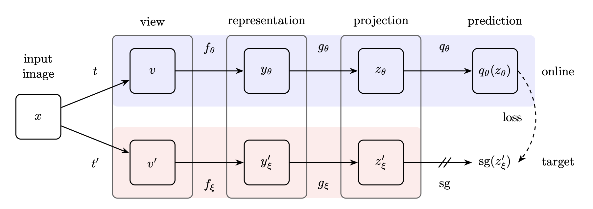
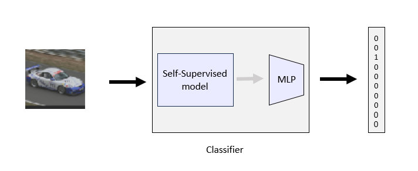
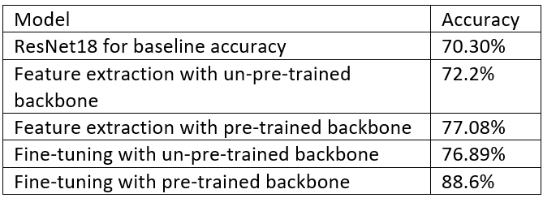

<h1 align="center">Self-Learner STL-10 classification using BYOL representations</h1>
<h2 align="center">Final project for the Technion's ECE Deep Learning course (046211)
</h2> 

  

    Tamar Sde Chen: <a href="https://www.linkedin.com/in/tamar-sde-chen">LinkedIn</a> , <a href="https://github.com/TamarSdeChen">GitHub</a>
   
    Hadar Rosenberg: <a href="https://www.linkedin.com/in/hadarrosenberg">LinkedIn</a> , <a href="https://github.com/HadarRosenberg">GitHub</a>
  

## Background
The purpose of our project is to create a robust methodology that can
leverage self-supervised learning to make effective use of unlabeled data.
First we create a baseline accuracy by training the ResNet18 network on the labeled data.
Because of this we can provide a reference score against which we could evaluate the effectiveness of our
self-supervised methods.
In the seconed part of our project we create a self-supervised model by using the BYOL 
(Bootstrap Your Own Latent) architecture. This network was trained on unlabeled data.
Afterward, we used transfer learning methods to transform the output from the BYOL to a classifier.

In inference, we show that Our self-learner method performs better than the classic supervised learning models.
### An illustration for the architecture we used:
### ResNet18 network: 

### BYOL model: 

### Classifier:

## Results
###  Summary table for all the accuracy results in the project

## Files in the repository

| File name                          | Purpsoe                                                                                                                                         |
|------------------------------------|-------------------------------------------------------------------------------------------------------------------------------------------------|
| `baseline_accuracy_ResNet18.ipynb` | ResNet18 model with FC layers for the labeled data                                                                                              |
| `train_BYOL.ipynb`                 | create the BYOL model and train with pre-trained or un-pre-trained ResNet18 on the unlabeled data                                               |
| `BYOL_feature_extraction.ipynb`    | load the BYOL model and get the representations. Train only the MLP part and test.                                                              |
| `BYOL_fine_tuning.ipynb`           | load the BYOL model and get the representations. Train both MLP and backbone and test.                                                          |

## Running and training the code

To run the baseline part:
1. Open the baseline_accuracy_ResNet18.ipynb notebook on collab and run all the cells.

To run the transfer learning part:
1. Visit the following link: https://drive.google.com/drive/folders/1mtiyMJe0VWIFO0JWjAOpVctFJslAJVbm?usp=sharing and
download the necessary files. If you plan to use the pre-trained ResNet18 model, please download the 
"pretrained_backbone_BYOL_checkpoint.pth" file. If you prefer to use the un-pretrained ResNet18 model, 
download the "BYOL_checkpoint.pth" file.
2. For the feature extraction method open BYOL_feature_extraction.ipynb notebook on collab, for fine-tuning method
open BYOL_fine_tuning.ipynb notebook on collab. 
3. Upload the checkpoint weights you downloaded in Step 1 to the notebook you have chosen.
4. Run the notebook. You will be asked to provide an input indicating which network weights you uploaded. 
If you uploaded the pre-trained ResNet18 network and named the file "pretrained_backbone_BYOL_checkpoint.pth," 
enter 'True.' If you uploaded the un-pre-trained ResNet18 network and named the file "BYOL_checkpoint.pth," enter
'False.'

To train the BYOL:
1. Open the train_BYOL.ipynb notebook on collab
2. Run the notebook, You will be asked to provide input indicating whether you want to use the pre-trained ResNet18
or not. If you want to use the pre-trained ResNet18, enter 'True'. Otherwise, enter 'False'.
3. After training completes, the final weights will be saved. Downland the file to your computer.
4. If you plan to use the trained weights for the transfer learning part, you can upload the downloaded file from the previous 
step. Then change the name of the "path_to_weights" variable in the transfer learning notebook you are using to match the 
uploaded file's name.

## Sources & References
### Sources
* The BYOL code was adapted from [Lightly AG](https://docs.lightly.ai/self-supervised-learning/examples/byol.html). 
### Refrences
* [STL-10 dataset explanation by Stanford](https://cs.stanford.edu/~acoates/stl10/).
* [Grill, Jean-Bastien, et al. "Bootstrap your own latent-a new approach to self-supervised learning." Advances in neural information processing systems 33 (2020): 21271-21284.](https://arxiv.org/abs/2006.07733).
* [Chen, Ting, et al. "A simple framework for contrastive learning of visual representations." International conference on machine learning. PMLR, 2020.](https://arxiv.org/abs/2002.05709).
[Chen, Xinlei, and Kaiming He. "Exploring simple siamese representation learning." Proceedings of the IEEE/CVF conference on computer vision and pattern recognition. 2021.](https://arxiv.org/pdf/2011.10566.pdf).
